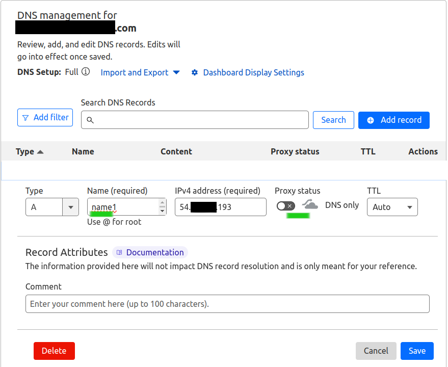

# Create and setup a machine in lightsail

*Select Virginia Region(Other regions either don't work or not tested)*


*Select Ubuntu 22 as Image*


*Select the cheapest machine*


*Select a name for the machine and create*


*Once the machine is created, head to the networking tab and grab its public IP address*


*In networking tab add the following ports*


# Setup the DNS domain name
*In cloudflare or your domain provider website, setup the dns for your domain. I highly suggest that you choose a subdomain and don't use root. Put the IP address of the machine in the dns record as follows:*


# Setup the xray

SSH to the machine from lightsail console:


And then run the following commands:

```
wget https://github.com/iftruebreakforloop/refactored-tribble/raw/main/lightsail.tar.gz

tar xvfz lightsail.tar.gz
cd lightsail

################# REPLACE THE DOMAIN NAME WITH YOUR OWN DOMAIN #######################

DOMAIN=name1.your-domain.com ./lightsail.sh
```

You might have to select OK a few times during the installation. 
Once the installation is finished successfully, the script will spit out the V2Ray config for
and you should be able to use it. Just copy the vless config somewhere(make sure there is no line
breakage in the config. Sometimes when you do copy and patse from the SSH screen it puts a line
break in the middle of a long string).

**Reboot the machine**(optional but highly recommended):
```sh
sudo reboot
```


Copy the config into your phone's clipboard. Open the V2Ray app on your phone and select import 
config from clipboard. Import, connect and enjoy!


